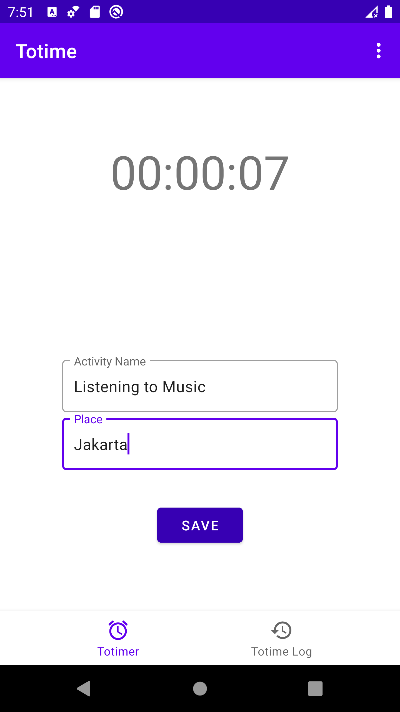
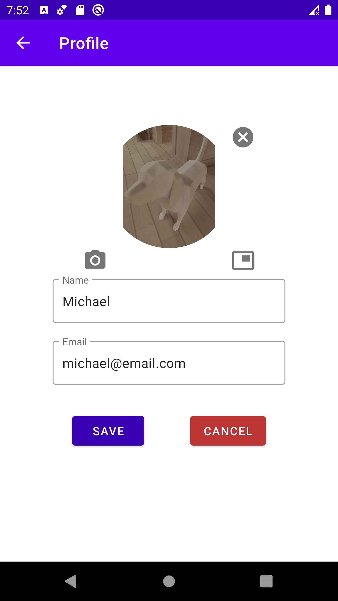
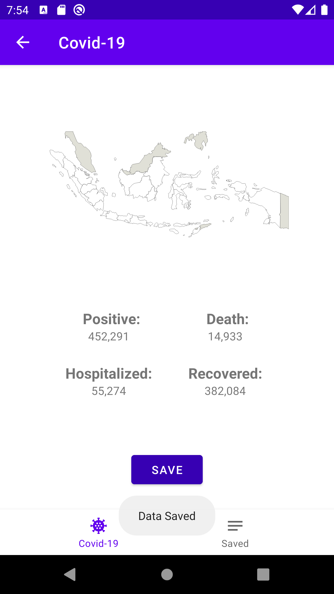

# Totime
An application to help you record and manage your activities, as well as get up-to-date covid cases in Indonesia.

## Author
[Michael Susanto - 1806205653 - Mobile Programming B](https://michaelsto.com)

## Techstacks
* Language: Kotlin
* Tools: Android Studio, gradle

## Features
* Totimer
	* Helps you record and manage your activities. You can also view your saved totimer in totime logs.
* Live information about Indonesia's Covid-19 Cases
	* You can see general information about Indonesia's Covid-19 Cases: Positive, Deaths, Hospitalized, Recovered.
	* Informations are gathered from [this](https://api.kawalcorona.com/indonesia) public API.
* Profile
	* You can customize your own profile in this application: name, email, and profile picture.
* All of your saved informations are stored in your own local database (Room database).
* Bilingual application: English and Indonesia.
	* You can set the language from your own system.

## Screenshot

